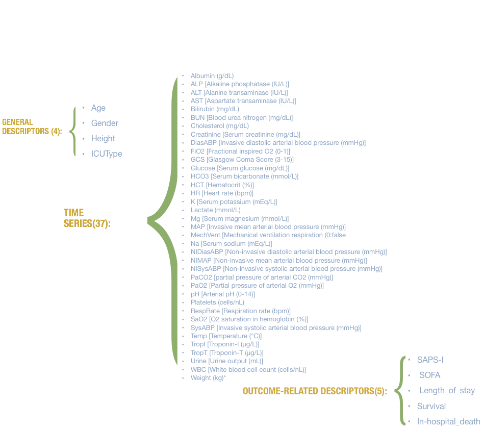
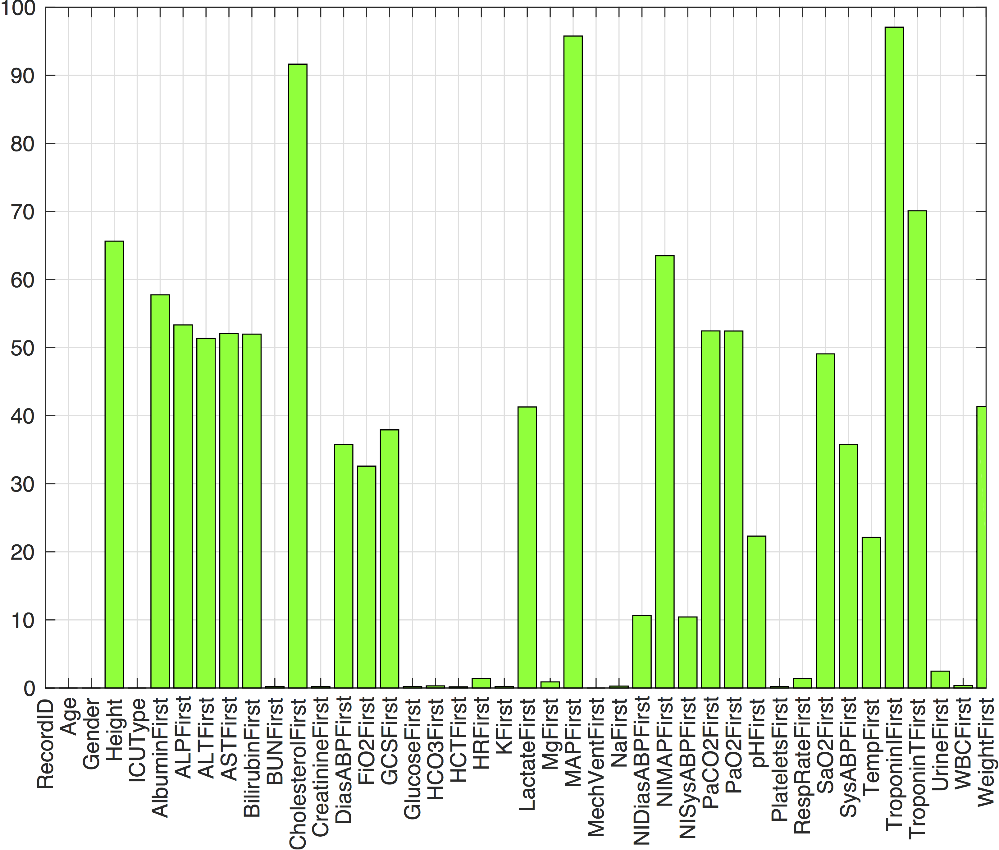
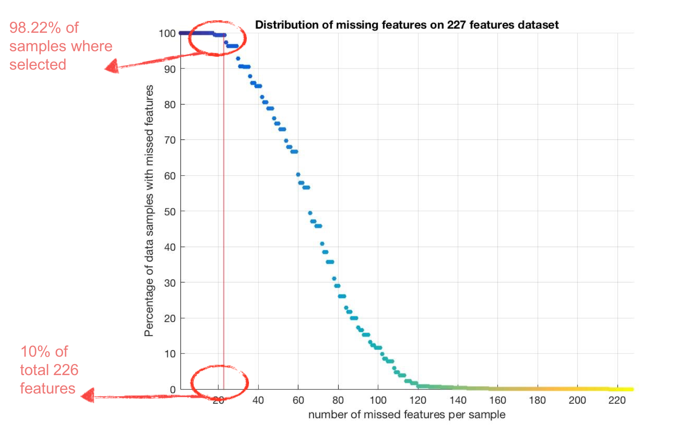
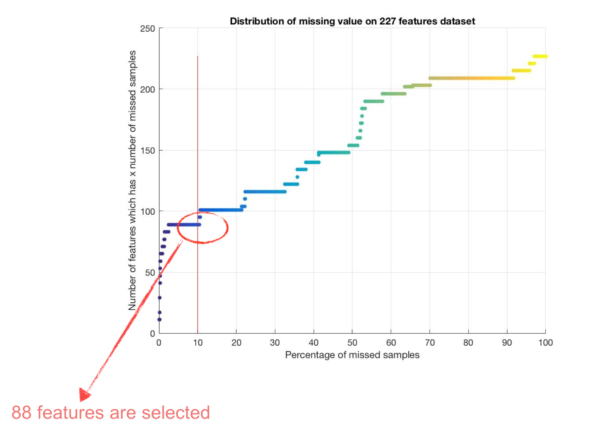

# ICUMortalityPrediction

### Introduction

The Intensive Care Unit (ICU) has been drawn a lot of attention since it is for critically ill patients who are seeking their life recovery. More than 5.7 million patients are admitted annually to ICUs in the United States (U.S.) for intensive or invasive Ventilation; stabilization of acute or life-threatening medical problems; comprehensive management of injury and/or illness; and restoration to stable health status or comfort while dying within an interdisciplinary and collaborative environment. Approximately 20% of acute care admissions are to an ICU; up to 58% of emergency department admissions result in an ICU admission. ICU patients are a heterogeneous population, but all share the need for frequent assessment and greater need for technological support compared to patients admitted to non-ICU beds [1]. Although the expenditure is significant, the average hospital mortality rate is still high.
Predicting mortality in patients hospitalized in ICU is crucial for assessing severity of illness, efficacy of medications, care guidelines, surgery and arbitrating the value of novel treatments, interventions and health care policies. In the past 30 years, considerable effort has been invested in modelling the risk of death in ICU patients [2]. During an ICU stay, a great number of physiological parameters are measured and stored. Parameters such as lab values, vital signs, diagnoses codes are employed in scoring systems to gauge the severity of the patients.

Many types of severity or prognostic scoring systems have been developed for the ICU that utilized a limited set of commonly measured clinical parameters; the parameters that can be manually accumulated into an acuity score. Several acuity scores have been proposed such as APACHE (Acute Physiology and Chronic Health Evaluation), SAPS (Simplified Acute Physiology Score), MODS (Multiple Organ Dysfunction Score), GCS (Glasgow Coma Scale) and SOFA (Sequential Organ Failure Assessment) scores. All those scores are designed to assess severity of illness and organ dysfunction in the ICU to identify high risk patients. Some of those requires less number of variables and accordingly are easier to calculate such as SOFA but some others demand a greater extent of parameters thus computationally more expensive to measure like SAPS.

Clinicians have been utilized a model developed upon logistic regression to transform each of those severity scores into a probability of death in the ICU. The ultimate goal has been constructing a well-validated, adjusted model. The performance of the prediction model has been evaluated by testing in the dataset that was used for model development. This evaluation made roughly by comparison between estimated probability of mortality produced by the model and the actual mortality observed by patients’ population and this can be validated statistically using formal goodness-of-fit tests such as chi-squared.

Despite their limited impact on patients’ status assessment and good discrimination between survivors and non-survivors in some cases, they have shown poor calibration, lack of consistent good fit [3] and lack of scalability to more clinical variables. 
It is proven that data mining and machine learning methods are helpful in discovering hidden patterns in the healthcare data. Currently, data mining approaches are confronting challenges to present more interpretable models to clinicians. Given the common uneven distribution of deceased vs. alive patients in the healthcare databases, the reasonable criterion to evaluate the performance of each model in terms of discrimination [4] would be:

### Target:
The development of a method for prediction of mortality rates in Intensive Care Unit (ICU) populations by comparing the efficacy of medications, care guidelines, surgery, and other interventions.

### Study Population:
The data used for the study consist of records from 17,762 ICU stays. All patients were adults who were admitted for a wide variety of reasons to cardiac, medical, surgical, and trauma ICUs. ICU stays of less than 48 hours have been excluded. Patients with DNR (do not resuscitate) or CMO (comfort measures only) directives were not excluded.

### Variables:
Excluding ‘Record_ID’ 41 variables were extracted from MIMIC-III database. Not all variables are available in all cases, however. Four of these variables are general descriptors (collected on admission), and the remainder are time series, for which multiple observations may be available. As the time series measurements were recorded in chronological order, their ‘First’, ‘Last’, ‘Highest’, ‘Lowest’, ‘Median’ and ‘Frequency’ of those measurements were depicted as their represented features.

## Data handling

### Feature selection:
The number of unmeasured samples on each of those 41 variables were counted and those variables with more than 10% unmeasured samples were excluded (A 10% threshold has been set).

### Handling missing values:
Unmeasured samples in the remaining 100 variables consist of general descriptors and time-series were imputed with the related variable mean value.

### Handling out of range values:
There were out of range values on ‘Age’; Patients whose age were 300 or more. Those were converted to the range 89 and beyond.
There were out of range values on ‘Height’, Patients whose height were 40cm or less. The mean value of other patients were imputed on those samples.
 
 
 

{:height="50%" width="50%"}

 
 
 

{:height="50%" width="50%"}
*Figure2: Percentage of missing data under the selected features*
 
 
 

{:height="50%" width="50%"}
*Figure3: Distribution of missing feature per sample*
 
 
 

{:height="50%" width="50%"}
*Figure4: Distribution of missing feature per sample*
 
 
 

## Results

|                                                                                                                                                                               |                |                 |                                          |                                        |                                            |            |        |        | 
|-------------------------------------------------------------------------------------------------------------------------------------------------------------------------------|----------------|-----------------|------------------------------------------|----------------------------------------|--------------------------------------------|------------|--------|--------| 
| **Dataset**                                                                                                                                                                       | **No. of samples** | **No. of features** | **Feature removal (num_samples_null < 10%)** | **sample removal (num_features_null<10%)** | **stepwise feature selection(P_value < 0.05)** | **Imputation** | **AUROC**  | **AUPRC**  | 
| 17762x226 fmat null values imputed with mean of existing feature's value                                                                                                      | 17762          | 226             | No                                       | No                                     | No                                         | mean       | 0.8562 | 0.4391 | 
| 17762x62 fmat null values imputed with mean of existing feature's value and stepwise feature selection is applied                                                             | 17762          | 62              | No                                       | No                                     | Yes                                        | mean       | 0.8633 | 0.4677 | 
| 17762x226 fmat null values imputed with random value within the [min max] range of feature's value                                                                            | 17762          | 226             | No                                       | No                                     | No                                         | random     | 0.8635 | 0.4425 | 
| 17762x70 fmat null values imputed with random value within the [min max] range of feature's value and stepwise feature selection is applied                                   | 17762          | 70              | No                                       | No                                     | Yes                                        | random     | 0.8709 | 0.4745 | 
| num_samples_null<10%  null values imputed with mean of existing feature's value                                                                                               | 17762          | 88              | Yes                                      | No                                     | No                                         | mean       | 0.8102 | 0.3515 | 
| num_samples_null<10%  null values imputed with random value within the [min max] range of  feature's value                                                                    | 17762          | 88              | Yes                                      | No                                     | No                                         | random     | 0.7869 | 0.2749 | 
| num_fsamples_null<10%  null values imputed with mean of existing feature's value and stepwise feature selection is applied                                                    | 17762          | 38              | Yes                                      | No                                     | Yes                                        | mean       | 0.8129 | 0.3559 | 
| num_samples_null<10%  null values imputed with random value within the [min max] range of feature's value and stepwise feature selection is applied                           | 17762          | 40              | Yes                                      | No                                     | Yes                                        | random     | 0.8129 | 0.3559 | 
| num_samples_null<10% and num_features_null<10%  null values imputed with mean existing feature's value                                                                        | 17446          | 88              | Yes                                      | Yes                                    | No                                         | mean       | 0.8128 | 0.3495 | 
| num_samples_null<10% and num_features_null<10%  null values imputed with mean of existing feature's value and stepwise feature selection is applied                           | 17446          | 40              | Yes                                      | Yes                                    | Yes                                        | mean       | 0.817  | 0.3592 | 
| num_samples_null<10% and num_features_null<10%  null values imputed with random value within the [min max] range of feature's value                                           | 17446          | 88              | Yes                                      | Yes                                    | No                                         | random     | 0.8141 | 0.3525 | 
| num_samples_null<10% and num_features_null<10%  null values imputed with random value within the [min max] range of feature's value and stepwise feature selection is applied | 17446          | 35              | Yes                                      | Yes                                    | Yes                                        | random     | 0.8154 | 0.3574 | 

